<div align="center">

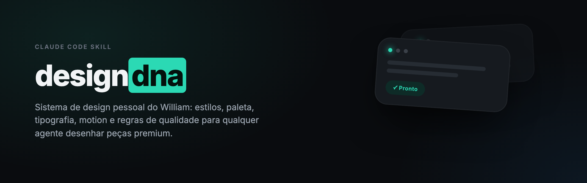

# Design DNA v2

Direção visual pessoal do William como um sistema de decisão: estética, composição, função, referências curadas e QA versionado.

</div>

## O que mudou na V2

A versão original já melhorava muito a aderência visual: no benchmark controlado mais completo, passou de 56,56% sem skill para 90,79% com skill. A V2 preserva esse repertório e corrige os limites que apareceram na prática:

- separa **direção estética**, **formato** e **pacote funcional**;
- remove dependência de caminho absoluto para o corpus local;
- formaliza exceções de cor para status, código, dados e marcas multicoloridas;
- bloqueia o problema residual mais recorrente: gradiente multicolorido em texto;
- cobre web, React, interface, social, carrossel, motion, direção e auditoria;
- carrega só as referências necessárias;
- adiciona validadores, gates de qualidade e novos casos de regressão/generalização.

O nome instalado continua `design-dna`. “V2” descreve a arquitetura, não cria uma skill concorrente com outro trigger.

## Sumário

- [O sistema em três eixos](#o-sistema-em-três-eixos)
- [Modos](#modos)
- [Instalação local](#instalação-local)
- [Uso](#uso)
- [Componentes vivos](#componentes-vivos)
- [Direções estéticas](#direções-estéticas)
- [Formatos](#formatos)
- [Biblioteca por progressive disclosure](#biblioteca-por-progressive-disclosure)
- [Corpus local de referência](#corpus-local-de-referência)
- [Validadores](#validadores)
- [Avaliação](#avaliação)
- [Estrutura](#estrutura)

## O sistema em três eixos

| Eixo | Opções | Decide |
|---|---|---|
| Estética | `soft-light`, `dark-technical`, `apple-contained`, `editorial-signal` | Base, materiais, tipografia e contenção |
| Formato | `product-flow`, `demo-code`, `explainer-carousel` | Proporção, sequência e composição |
| Função | página, LP longa, ecommerce, UX, componente, motion | Conteúdo, conversão, comportamento e QA |

Exemplos:

- um app flow pode ser `product-flow + soft-light`;
- um tutorial pode ser `demo-code + dark-technical`;
- um carrossel técnico pode usar `explainer-carousel + editorial-signal`;
- uma landing page pode usar apenas `editorial-signal + página`.

Isso evita o problema da taxonomia anterior, em que formatos e estéticas competiam como se fossem sete estilos equivalentes.

## Modos

- `build`: cria e valida uma peça nova;
- `glow-up`: diagnostica, preserva, implementa e compara um redesign;
- `audit`: revisa sem editar;
- `concept`: prova uma direção com menor custo;
- `ingest`: aprende com novas referências sem copiar conteúdo.

## Instalação local

Durante o desenvolvimento, use a pasta V2 diretamente. Para instalar uma cópia no runtime do agente:

```bash
# Codex e agentes compatíveis
cp -R /caminho/para/design-dna-v2 ~/.agents/skills/design-dna

# Claude Code
cp -R /caminho/para/design-dna-v2 ~/.claude/skills/design-dna
```

Não renomeie o diretório instalado para `design-dna-v2`; o frontmatter e o nome canônico permanecem `design-dna`.

## Uso

A skill deve acionar automaticamente em pedidos como:

```text
cria uma LP premium para esse produto
faz um glow up nessa página sem mudar a marca
quero um dashboard no meu estilo
monta um carrossel educativo com antes e depois
audita o visual desse app, mas não altera nada
usa essas referências para alimentar meu design DNA
```

Ao iniciar, ela declara uma direção curta e segue trabalhando. Só pede escolha quando alternativas mudarem materialmente custo, conteúdo ou arquitetura.

## Componentes vivos

As referências ensinam técnica, não conteúdo. Os seis GIFs abaixo demonstram padrões aplicados em cenários originais; as receitas completas ficam em `references/componentes-premium.md` e o roteamento curto em `references/component-gallery.md`.

<table>
<tr><td width="50%" align="center">


**Botão Assinatura**
<br><sub>idle → progresso → checkmark desenhado</sub>

</td><td width="50%" align="center">


**Anel de Foco Premium**
<br><sub>anel duplo em `:focus-visible`</sub>

</td></tr>
<tr><td width="50%" align="center">

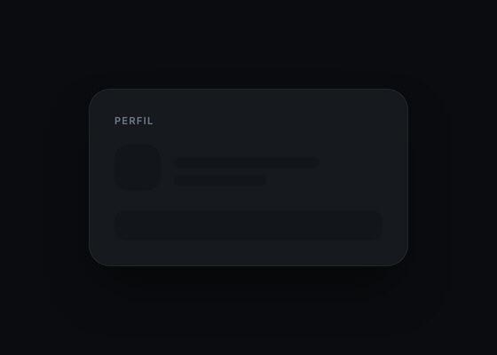

**Esqueleto Espelho**
<br><sub>loading na geometria do conteúdo final</sub>

</td><td width="50%" align="center">

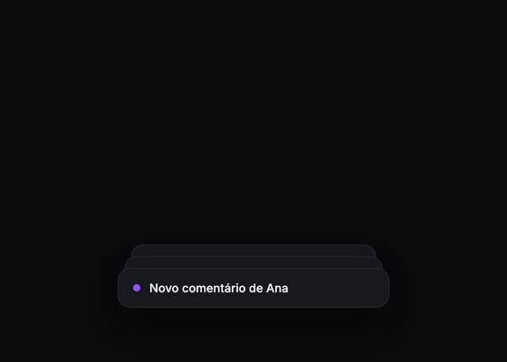

**Toast Empilhado**
<br><sub>profundidade, hover e foco acessível</sub>

</td></tr>
<tr><td width="50%" align="center">

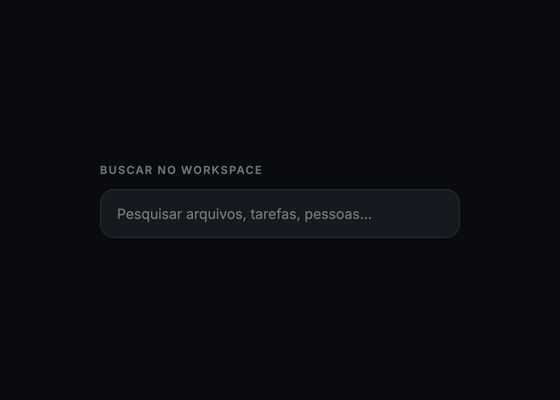

**Spotlight de Borda**
<br><sub>luz local sem contaminar a superfície</sub>

</td><td width="50%" align="center">

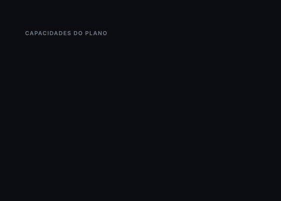

**Bento Animado**
<br><sub>pesos reais e entrada escalonada</sub>

</td></tr>
</table>

## Direções estéticas

<table>
<tr><td width="50%">

### `soft-light`

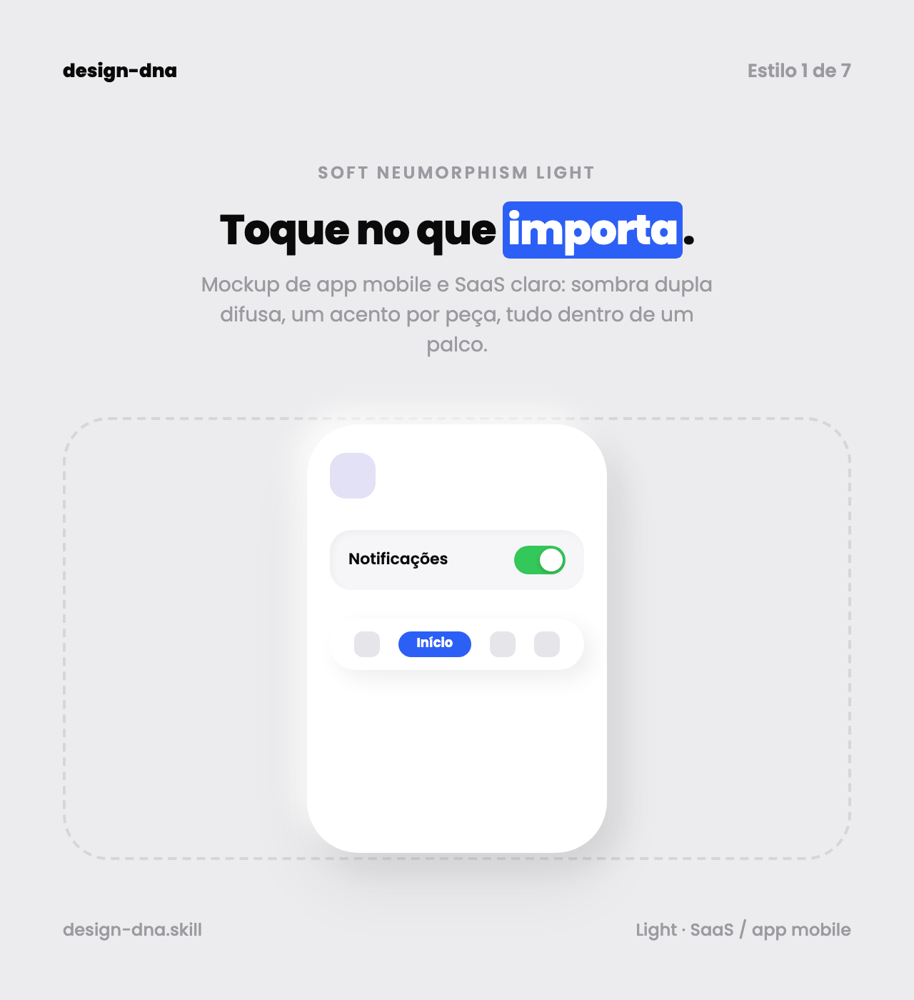

Base off-white, superfícies táteis, sombra dupla suave e um acento operacional.

</td><td width="50%">

### `dark-technical`

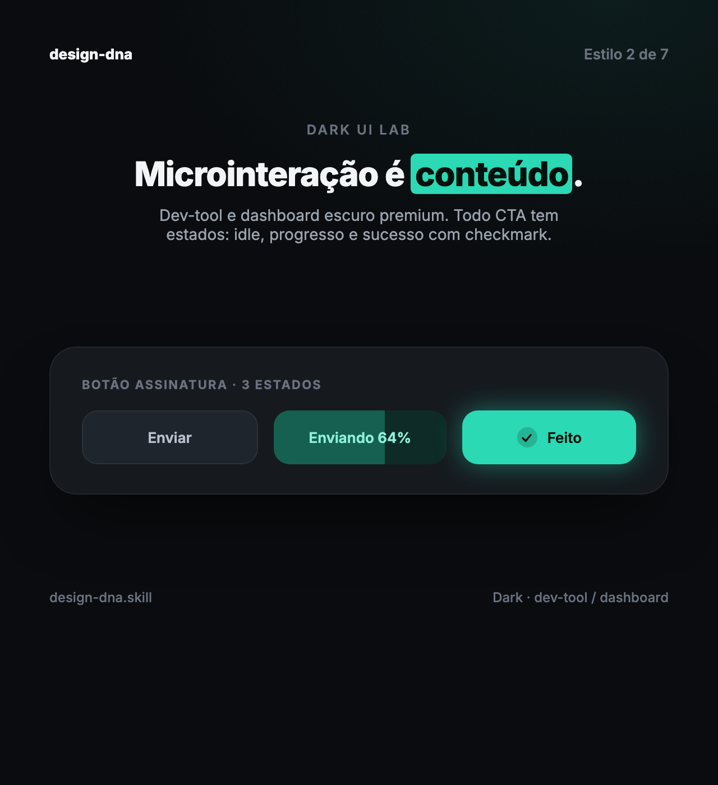

Base quase-preta lisa, superfícies discretas, glass localizado e acento luminoso.

</td></tr>
<tr><td width="50%">

### `apple-contained`

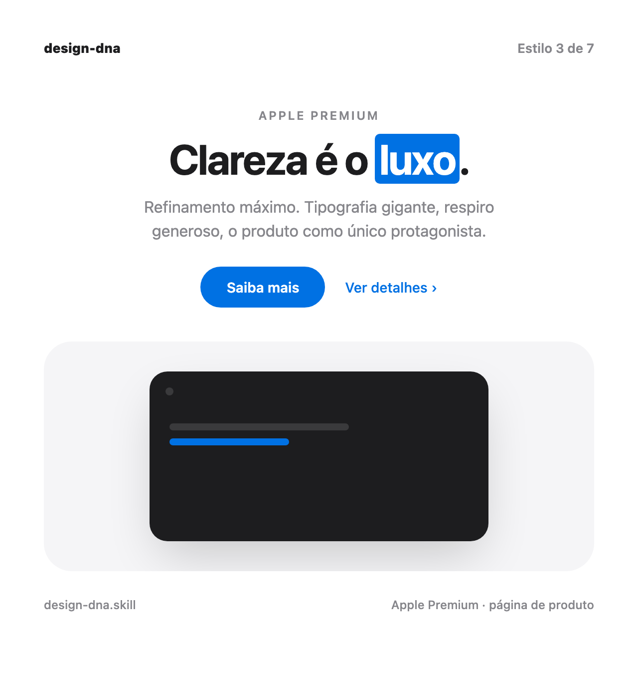

Tipografia protagonista, capítulos amplos, produto como herói e extrema contenção.

</td><td width="50%">

### `editorial-signal`

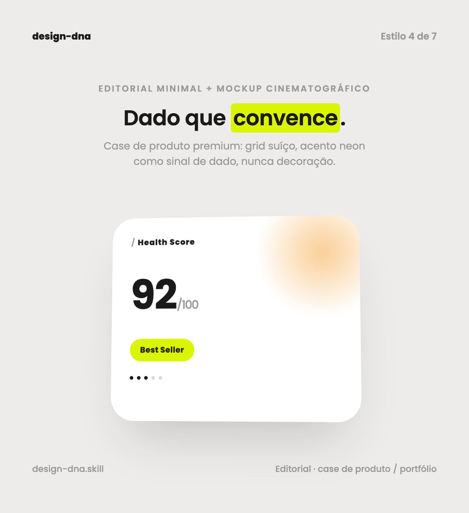

Grid editorial, dados como narrativa, mockup cinematográfico e cor como sinal.

</td></tr>
</table>

## Formatos

<table>
<tr><td width="33%">

### `product-flow`

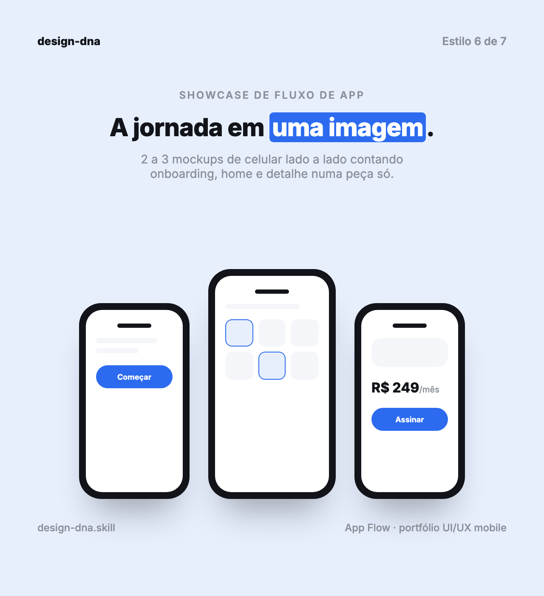

Jornada de app em 2 ou 3 telas.

</td><td width="33%">

### `demo-code`

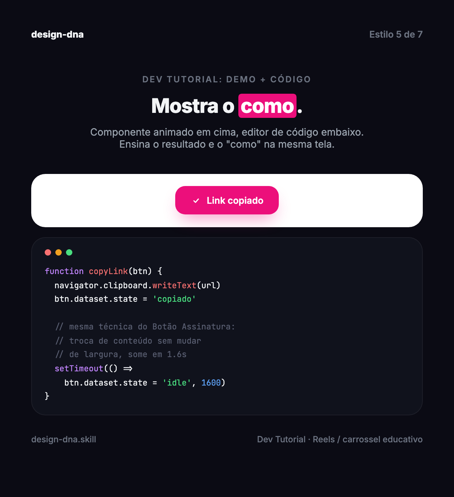

Resultado vivo e técnica na mesma peça.

</td><td width="33%">

### `explainer-carousel`

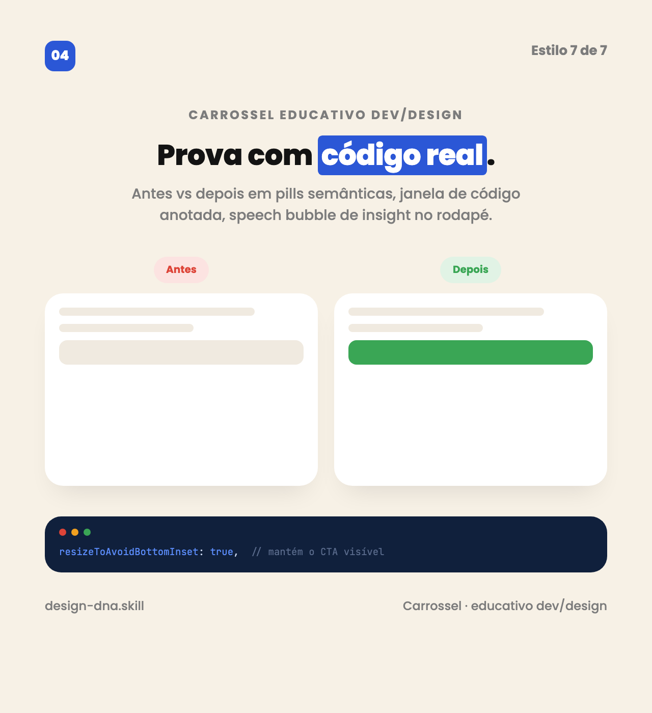

Sequência educativa, comparativo e prova com código.

</td></tr>
</table>

## Biblioteca por progressive disclosure

`references/INDEX.md` é o roteador. O agente lê uma direção, opcionalmente um formato e só os pacotes funcionais necessários.

| Grupo | Conteúdo |
|---|---|
| Estrutura | heroes, seções, pricing, prova, footer e LP longa |
| Conversão | copy, objeções, persuasão ética e ecommerce |
| Interface | UX, acessibilidade, formulários, estados e componentes |
| Motion | princípios, scroll, texto, cursor e fallbacks |
| Processo | gates de qualidade, ingestão e registro canônico |

Livros grandes têm índice e devem ser abertos pela seção relevante. `references/componentes-premium.md`, por exemplo, não precisa ser carregado inteiro para implementar um único focus ring.

## Cor com exceções explícitas

“Um acento” agora significa uma família operacional dominante, não a proibição cega de toda cor adicional:

- `accent`: CTA, seleção e sinal visual;
- `status`: erro, sucesso, alerta e info, sempre locais;
- `syntax`: multicolor permitido dentro de código;
- `data`: escala adicional quando a interpretação exigir;
- `brand`: cores reais da marca, com uma eleita para interação.

Gradiente azul-roxo-rosa em texto continua proibido por padrão. Foi a regressão mais consistente dos benchmarks da V1.

## Corpus local de referência

O repositório não redistribui automaticamente os 35,2 MB de mídia de terceiros. A resolução é portátil:

1. caminho fornecido pelo usuário;
2. `DESIGN_DNA_REFERENCE_ROOT`;
3. pasta irmã `../referencias-instagram/por-estilo/`;
4. previews empacotados.

```bash
export DESIGN_DNA_REFERENCE_ROOT="/caminho/para/por-estilo"
python3 scripts/reference_manifest.py
```

`references/corpus-profile.yaml` registra cobertura e vieses: editorial e soft-light dominam o corpus; Apple não tem lote externo e usa conhecimento curado + preview empacotado.

## Validadores

### Integridade da skill

```bash
python3 scripts/doctor.py .
```

Valida frontmatter, tamanho do `SKILL.md`, links, caminhos absolutos, code fences, índices e schema das evals.

### Preflight de output web

```bash
python3 scripts/preflight.py caminho/para/index.html
python3 scripts/preflight.py caminho/para/index.html --json
```

Procura regressões como travessão, metadata ausente, imagem sem alt, motion sem reduced-motion, falta de foco, badge reflexo, fundo genérico e gradiente multicolorido em texto. É uma heurística; o render e o julgamento visual continuam obrigatórios em produção.

## Gates de qualidade

`references/quality-gates.md` cobre:

- intenção e conteúdo;
- coerência visual;
- anti-slop e originalidade;
- responsividade;
- acessibilidade e interação;
- comportamento e performance;
- entrega e limites reais da verificação.

## Avaliação

A suíte histórica tinha quatro prompts HTML e 33 critérios. A V2 mantém esses casos para comparação e acrescenta casos de regressão/generalização para:

- Glow Up com preservação de conteúdo e comportamento;
- ecommerce;
- marca com status semântico;
- React;
- motion acessível;
- peça social em SVG.

Esses casos são públicos e, portanto, não são holdouts secretos. O workspace de execução registra outputs, grades e viewer fora do pacote instalável; modelo, commit e ambiente precisam ser informados para uma reprodução completa.

### Smoke test V1 x V2

Em 10 de julho de 2026, quatro casos novos foram executados uma vez em cada versão. A V2 passou 33/33 expectativas e a V1 passou 32/33; a única diferença objetiva foi um overline decorativo antes do H1 na V1. Isso confirma paridade funcional e a aplicação dos novos gates, mas não prova superioridade visual geral: a V1 permaneceu mais expressiva em alguns renders. Consulte `evals/RESULTS.md` para escopo, limitações e leitura correta.

O workspace de benchmark fica fora da skill. Assim, evidência de avaliação não infla o pacote instalado.

`evals/trigger-evals.json` acrescenta 20 casos de precisão do trigger, incluindo near-misses de debugging, iOS/Apple técnico, performance sem mudança visual, texto puro e design system já fechado.

Duas classificações independentes do frontmatter acertaram 20/20 casos. Esse resultado valida a redação contra a suíte pública, mas não substitui medição do roteador real em produção.

## Estrutura

```text
design-dna-v2/
├── SKILL.md
├── README.md
├── CHANGELOG.md
├── assets/
│   ├── components/
│   └── style-*.png
├── docs/
│   └── V2-ARCHITECTURE.md
├── evals/
├── references/
│   ├── INDEX.md
│   ├── design-registry.yaml
│   ├── quality-gates.md
│   └── ...
├── scripts/
│   ├── doctor.py
│   ├── preflight.py
│   └── reference_manifest.py
└── tests/
```

## Segurança operacional

- A skill não publica nem faz deploy por conta própria.
- O modo `audit` é somente leitura.
- O corpus externo é referência interna quando direitos não estão verificados.
- A regra anti-cópia vale para código, imagem, copy, produto e sequência narrativa.
